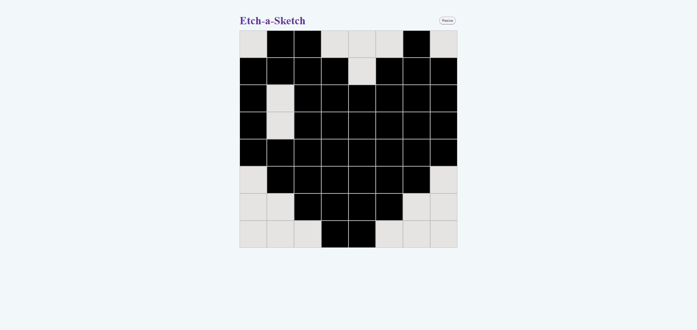

# odin-projects-etch-a-sketch

A browser version of something between a sketchpad and an Etch-A-Sketch, to flex my DOM manipulation skills (acc. to The Odin Project).

The application allows users to "draw" on a grid by hovering their mouse over cells. You can also change the grid size and reset the drawing.

## Screenshots



## Setup

1.  Clone the repository:

    ```bash
    git clone https://github.com/szxivk/odin-projects-etch-a-sketch.git
    ```

2.  Open `index.html` in your browser.

## Tech Stack

- **HTML**
- **CSS**
- **JavaScript**
